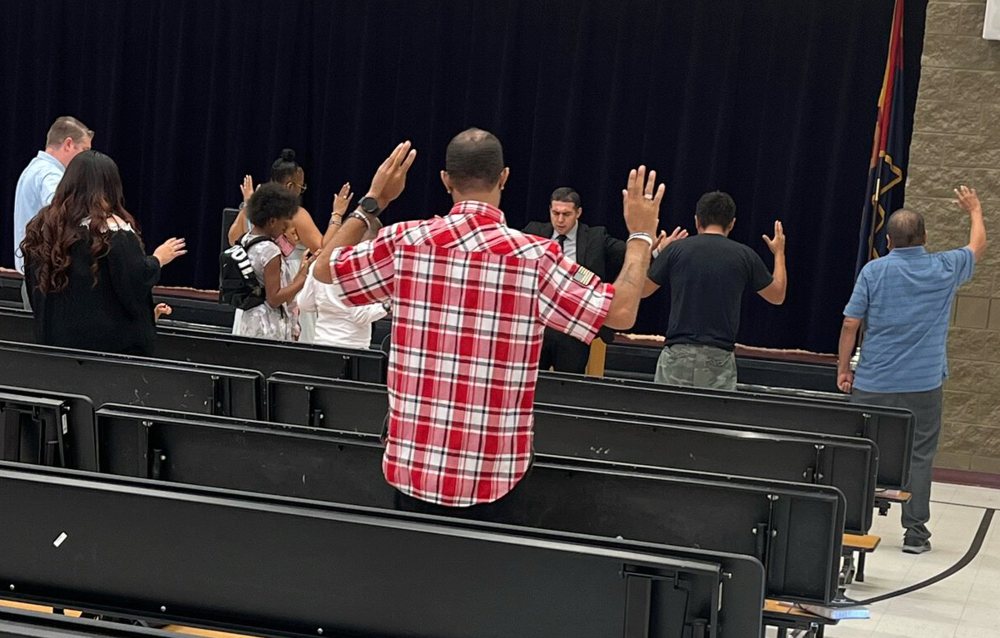

# What To Expect

We are a new, small church plant with a large heart. Right now we're holding services in two schools while we look for a permanent location.

We do provide child care for smaller children who are unused to a church setting, but we love having children in our services and we're pretty chill.

Our worship services are Pentecostal in nature, featuring music, praise, Bible-based preaching, ministry and prayer for personal needs. Services generally run around 1 hour. We welcome everyone and we're always willing to pray for healing or any other need.